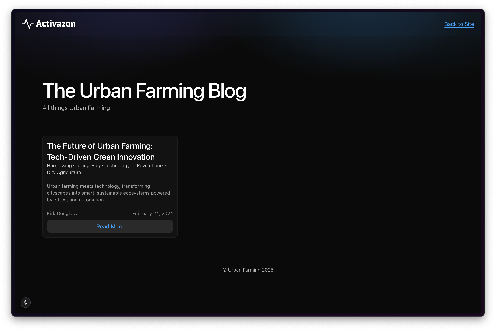
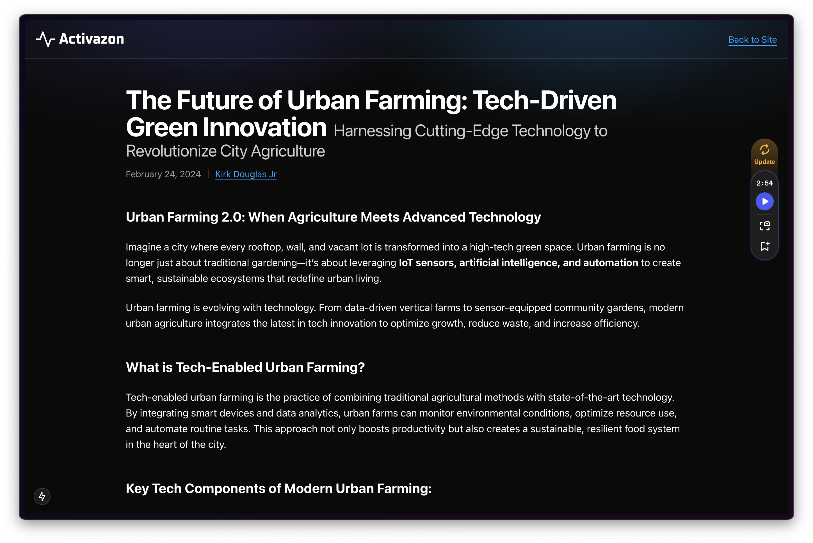

# Next.js MDX Blog Template

| Screenshot 1                        | Screenshot 2                        |
| ----------------------------------- | ----------------------------------- |
|  |  |

This repository contains a Next.js blog template that supports writing blogs in MDX. All blog posts are stored in the `contents/` folder. This template is designed to help you quickly set up a modern, performant blog with the flexibility of MDX for writing content.

## Features

- **MDX Support:** Write your blog posts in MDX to include JSX components alongside Markdown.
- **Content-Driven:** All blog posts are stored in the `contents/` folder for easy management.
- **Next.js Framework:** Built on Next.js for optimal performance, SEO, and ease of deployment.
- **Dynamic Routing:** Automatically generate routes for your blog posts based on content slugs.
- **Customizable:** Easily customize the look and feel with your own styles and components using tailwindcss.

## Getting Started

### Prerequisites

- [Node.js](https://nodejs.org/) (version 14 or higher)
- [Yarn](https://yarnpkg.com/) or npm

### Installation

1. **Clone the repository:**

   ```bash
   git clone git@github.com:kiorq/next-blog-template.git
   cd nextjs-mdx-blog-template
   ```

## Writing Blog Posts

1. **Create MDX Files:**

   - Add your blog posts as `.mdx` files in the `content/` directory
   - Use frontmatter for comprehensive metadata:

   ```mdx
   ---
   title: "Your Post Title"
   sub_title: "An Optional Subtitle"
   date: "2024-03-20T08:00:00+08:00"
   author: "Your Name"
   author_profile: "https://linkedin.com/in/yourprofile"
   excerpt: "A brief summary of your post..."
   slug: "your-post-slug"
   tags: ["tag1", "tag2"]
   category: "Your Category"
   og_title: "Custom Open Graph Title"
   og_description: "Custom Open Graph Description"
   reading_time: 5
   published: true
   ---
   ```

2. **Using MDX Features:**
   - Write regular markdown content
   - Use HTML elements with Tailwind classes:
   ```mdx
   <h3 className="text-center text-2xl font-semibold">Custom Styled Heading</h3>
   ```
   - Create responsive tables using standard markdown syntax
   - Add line breaks with `<br/>`

### Theme Customization

1. **Color Scheme:**
   Edit `src/app/globals.css` to modify the color palette:

   ```css
   :root {
     --background: 10, 10, 10; /* Dark background */
     --foreground: 255, 255, 255; /* White text */
     --primary: 50, 243, 174; /* Primary accent */
     --secondary: 0, 224, 255; /* Secondary accent */
   }
   ```

   - Colors are defined in RGB format (without rgba)
   - Gradient variations are automatically generated:
     - `--gradient-primary`
     - `--gradient-secondary`
     - `--gradient-highlight`
     - `--gradient-primary-soft`
     - `--gradient-secondary-soft`
     - `--gradient-shadow`

2. **Gradient Background:**
   The template includes a mesh gradient background that uses the defined colors:
   ```css
   .mesh-gradient-bg {
     /* Pre-configured gradient that uses the theme colors */
     background: radial-gradient(...);
   }
   ```

### Custom Components

1. **Adding Components:**

   - Define custom components in `src/components/custom.tsx`:

   ```typescript
   export default {
     CustomAlert: ({ children }) => (
       <div className="p-4 bg-opacity-20 bg-primary rounded">{children}</div>
     ),
     // Add more components as needed
   };
   ```

2. **Using Components:**

   - Components are automatically available in MDX files
   - No need for manual imports
   - Usage example:

   ```mdx
   <CustomAlert>This is a custom alert component!</CustomAlert>
   ```

3. **Component Integration:**
   - Components are automatically merged through `src/components/all.tsx`
   - Includes core components, table components, and your custom components
   - No additional configuration needed

### Brand Assets Customization

1. **Logo:**

   - Replace `/public/logo.svg` with your own brand logo
   - Update the SVG content or use a different image format if preferred

2. **Manifest Settings:**

   - Update `/public/site.webmanifest` with your app information:

   ```json
   {
     "name": "Your App Name",
     "short_name": "Short Name",
     "description": "Your app description"
     // ... existing manifest content ...
   }
   ```

3. **Icons:**
   - Replace the following icons in the `/public` directory with your own:
     - `android-chrome-192x192.png`
     - `android-chrome-512x512.png`
